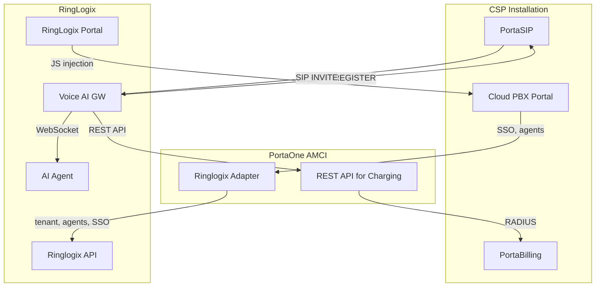
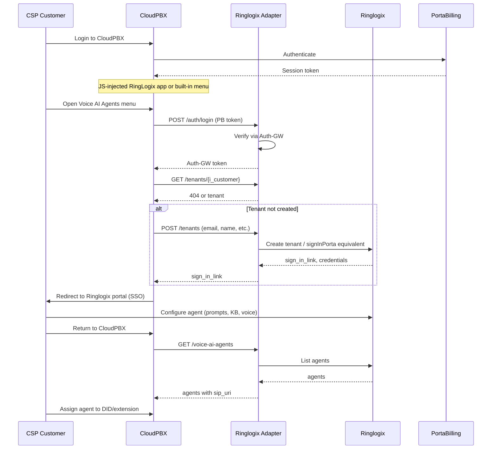
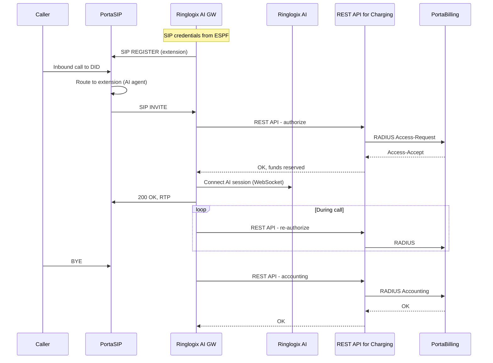
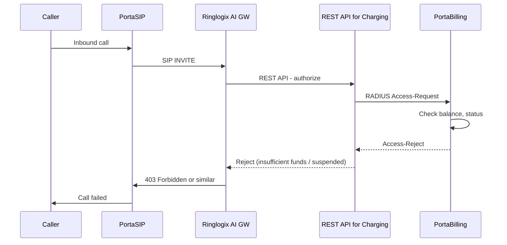
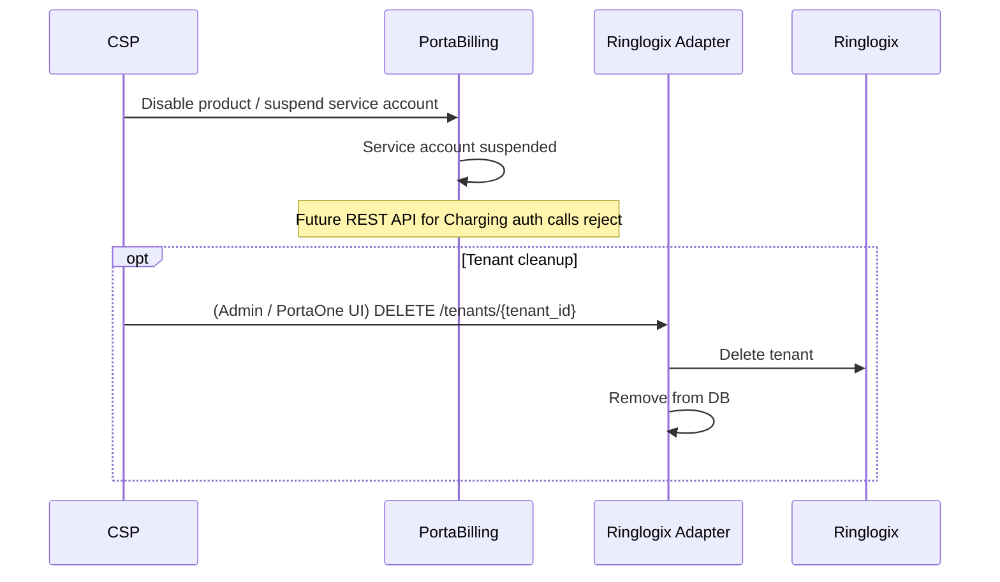

# Ringlogix Vendor Onboarding Documentation Plan

## Document Purpose

A vendor onboarding guide for Ringlogix that clearly defines:

- **Who makes what** (PortaOne, Ringlogix, CSP)
- **Interfaces** between parties
- **Actions per party** when signing a new CSP
- **End-to-end flows** for the four key scenarios

The document will be based on the current Apifonica implementation ([Add-on mart part.md](Add-on mart part.md), [CloudPBX part.md](CloudPBX part.md), [apifonica-adapter](apifonica-adapter/)) but adapted for Ringlogix's architecture as agreed by Andriy, Mike, Ringlogix.

---

## Architecture (per MoM)

**Key decisions from MoM:**

1. **Gateway**: RingLogix keeps their **existing** Voice AI Gateway (SIP to PortaSwitch, WebSocket to agent). No PortaOne gateway.
2. **Billing**: PortaOne's **REST API for Charging** – Add-on Mart module that converts REST API requests to RADIUS for PortaBilling. [Product page](https://www.portaone.com/add-on-mart-modules/rest-api-for-charging/)
3. **Registration**: SIP registration for agents (like users/extensions), not static IP routing. Enables better reporting, routing, redundancy (SRV records).
4. **Commercials**: RingLogix bills CSP (wholesale); CSP bills end customer (retail). CSP pays PortaOne for REST API for Charging ~$395/mo per instance and for Ringlogix Adapter (fixed price per month).
5. **PoC focus**: (a) JS injection into Cloud PBX portal; (b) Authorization via REST API for Charging.

**High-level architecture:**

*AMCI = Add-on Mart Cloud Infrastructure (PortaOne-hosted Add-on Mart modules).*




---

## Architecture Comparison: Apifonica vs Ringlogix


| Aspect          | Apifonica (current)                                    | Ringlogix (per MoM)                                                                     |
| --------------- | ------------------------------------------------------ | --------------------------------------------------------------------------------------- |
| **Gateway**     | PortaOne Voice AI GW                                   | RingLogix's existing Voice AI GW (SIP to switch, WebSocket to agent)                    |
| **SIP**         | SIP URI to PortaOne GW; GW forwards via WebSocket      | RingLogix AI GW registers to PortaSIP as regular extension                              |
| **Charging**    | RADIUS from PortaOne GW to PortaBilling                | RingLogix AI GW → **REST API for Charging** → PortaBilling (RADIUS)                      |
| **REST API for Charging** | N/A                                              | PortaOne Add-on Mart module; converts REST to RADIUS for PortaBilling; [product page](https://www.portaone.com/add-on-mart-modules/rest-api-for-charging/) |
| **Credentials** | Apifonica API creds (account_sid, token) in adapter DB | ESPF webhooks push SIP credentials from PortaBilling to Ringlogix                       |
| **Portal**      | SSO via signInPorta → Apifonica portal                 | **JS injection** of RingLogix app into Cloud PBX portal; SSO to Ringlogix portal        |


---

### Trust Model: CSP and Ringlogix

#### Does the CSP send SIP credentials to Ringlogix?

**Yes, but only for AI agent extensions.** PortaBilling (CSP's) pushes SIP credentials to Ringlogix via ESPF webhooks when an AI agent extension is created or updated. The payload includes: `event_type`, `installation_id`, `tenant_id` (i_customer = PortaBilling Customer ID), SIP username, password, extension ID. *Note: Customer is distinct from Account — Account = service account / phone line; SIP credentials are provisioned per Account (extension) and pushed to Ringlogix via ESPF.*

- **Scope**: Only credentials for extensions explicitly provisioned as AI agents. The CSP does **not** send credentials for regular users, DIDs, or other services.
- **Direction**: Push from PortaBilling → Ringlogix webhook (CSP initiates the flow by creating AI agent extensions).
- **Trust implication**: The CSP trusts Ringlogix to use credentials solely for SIP registration and to handle them securely.
- **Usage control**: REST API for Charging enforces real-time authorization/charging to prevent overconsumption or unpaid Voice AI usage. If a subscriber is suspended in PortaSwitch, Voice AI authorization fails and service is blocked.

#### Does Ringlogix need API access to the CSP's PortaSwitch?

**No.** Ringlogix does **not** need REST/API access to PortaSwitch (PortaSIP or PortaBilling).


| Access type                      | Required?      | How                                                                                                                            |
| -------------------------------- | -------------- | ------------------------------------------------------------------------------------------------------------------------------ |
| PortaSIP                         | Yes (SIP only) | Standard SIP: REGISTER, INVITE, BYE. No PortaSIP admin or REST API.                                                            |
| PortaBilling                     | No (indirect)  | Via REST API for Charging. Ringlogix AI GW calls REST API; module converts to RADIUS for PortaBilling. |
| BillingAdmin / PortaBilling REST | No             | Not used.                                                                                                                      |
| CloudPBX / portal config         | No             | End users configure via CloudPBX; Ringlogix app is injected via JS. No Ringlogix API calls to the portal.                      |


**Summary**: Ringlogix interacts with the CSP's PortaSwitch only through (1) SIP signaling/media to PortaSIP and (2) the REST API for Charging for billing. No direct PortaSwitch APIs are required.

---

### Monetization


| Flow               | Payer        | Payee     | What                                                   |
| ------------------ | ------------ | --------- | ------------------------------------------------------ |
| PortaOne ← CSP     | CSP          | PortaOne  | REST API for Charging ~$395/mo per instance            |
| PortaOne ← CSP     | CSP          | PortaOne  | Ringlogix Adapter (fixed price per month; Add-on Mart) |
| Ringlogix ← CSP    | CSP          | Ringlogix | Per-minute and/or per-agent subscription (wholesale)   |
| CSP ← End customer | End customer | CSP       | Per-minute, subscription, or bundled (retail)          |


**Call billing (Flow B):** REST API for Charging → PortaBilling deducts from end customer's service account (CSP's billing). CSP invoices end customer. Ringlogix invoices CSP separately for AI usage (wholesale).

**Revenue assurance:** End customer non-payment → REST API for Charging rejects auth. CSP non-payment to Ringlogix → Ringlogix suspends CSP's service.

---

## Document Structure

### 1. Parties and Responsibilities

**PortaOne**

- Add-on Mart: sells REST API for Charging (~$395/mo per instance) and Ringlogix Adapter (fixed price per month) to CSPs
- **REST API for Charging**: Add-on Mart module; converts REST to RADIUS for PortaBilling
- Ringlogix Adapter (Auth-GW + Adapter) for CloudPBX integration (tenant, SSO, agent list)
- PortaBilling: billing, ESPF webhooks
- PortaSIP: SIP registrar, call routing
- CloudPBX portal: end-user UI; **JS injection** mechanism for embedding RingLogix app

**Ringlogix**

- **Existing** Voice AI Gateway: SIP to PortaSIP, WebSocket to agent; calls REST API for Charging for auth/accounting (per installation; Ringlogix maps extension/tenant → installation → API)
- AI platform: agent configuration, LLM, TTS/STT, CRM
- Ringlogix portal: agent self-care (SSO target)
- Receives ESPF webhooks for SIP credential sync

**CSP (PortaOne customer)**

- Signs contract with Ringlogix; configures Ringlogix Voice AI in Add-on Mart (supplies master token); subscribes (pays for REST API for Charging, Adapter)
- Configures PortaBilling (nodes, tariffs, products)
- Manages end-customers; can configure agents on their behalf via CloudPBX

---

### 2. Interfaces

**Auth-GW** (Authentication Gateway): A PortaOne microservice, part of the Ringlogix Add-on Mart module. Verifies PortaBilling tokens and issues internal JWT tokens for the Adapter. Deployed together with the Ringlogix Adapter.

**Ringlogix Adapter API** (PortaOne provides; mirrors Apifonica adapter):


| Endpoint                      | Purpose                                                       |
| ----------------------------- | ------------------------------------------------------------- |
| `POST /auth/login`            | Exchange PortaBilling token → Auth-GW token                   |
| `GET /tenants/{tenant_id}`    | Check if tenant exists in Ringlogix (tenant_id = i_customer)   |
| `POST /tenants`               | Create tenant in Ringlogix (tenant_id = i_customer); returns `sign_in_link` |
| `GET /voice-ai-agents`        | List agents for tenant; returns `agent_id`, `name`, `sip_uri` |
| `DELETE /tenants/{tenant_id}` | Admin: delete tenant (tenant_id = i_customer)                 |


**Ringlogix API** (Ringlogix must provide to adapter):

- Tenant creation/registration (equivalent to Apifonica `signInPorta`)
- SSO link generation
- List agents (scenarios) with agent_id, name
- Agent-to-extension mapping (for SIP URI / registration)

**REST API for Charging** (PortaOne Add-on Mart module; [product page](https://www.portaone.com/add-on-mart-modules/rest-api-for-charging/)):

- Converts REST API requests to RADIUS for PortaBilling
- Pre-call: authorize session, reserve funds (Ringlogix AI GW passes extension/session info so module maps to correct Customer/service account in RADIUS)
- Mid-call: re-authorize
- Post-call: accounting, deduct, CDR
- ~$395/mo per instance (one instance per CSP installation; Ringlogix receives API URL/key per installation when CSP subscribes)

**PortaBilling ESPF** (PortaOne provides):

- Webhook to Ringlogix when SIP credentials created/updated for AI agent extensions
- Payload: `event_type` (create/update/delete), `installation_id`, `tenant_id` (i_customer = Customer ID), SIP username, password, extension. *Account = service account / phone line; credentials pushed per extension.*
- *Exact payload to be confirmed with PortaBilling ESPF documentation*

**JS injection / CloudPBX** (PortaOne provides):

- Mechanism to embed RingLogix's JavaScript application shell into Cloud PBX portal
- **PoC priority**: Workshop/knowledge transfer from PortaOne to accelerate RingLogix R&D

---

### 3. Onboarding a New CSP (Summary)

**PortaOne**: Add Ringlogix as partner; provision REST API for Charging; deploy Adapter; provide docs; workshop on JS injection.

**Ringlogix**: Sign contracts with CSPs; issue master token per CSP; configure ESPF webhook; provide API base URL and portal URL to PortaOne. Consumes REST API for Charging (receives API URL, key when CSP subscribes; CSP pays for the service).

**CSP**: Sign contract with Ringlogix; configure Ringlogix Voice AI in Add-on Mart (supply master token); subscribe (pays for REST API for Charging, Adapter); configure PortaBilling; configure adapter URL/domain.

### 3a. CSP Onboarding Flow (Detailed)

*This flow happens before any end-customer can use AI agents. It establishes the CSP as a Ringlogix Voice AI reseller.*

```mermaid
sequenceDiagram
    participant CSP
    participant AOM as Add-on Mart
    participant PO as PortaOne
    participant RL as Ringlogix
    participant PB as PortaBilling

    Note over CSP,RL: Phase 1 - Commercial & Add-on Mart
    RL->>CSP: (Pre) Contract, master token
    RL->>PO: (Pre) API base URL, portal URL
    CSP->>AOM: Configure Ringlogix Voice AI; supply master token
    PO->>AOM: (Pre) Ringlogix listed as partner
    AOM-->>CSP: Configuration active

    Note over CSP,RL: Phase 2 - PortaOne Provisioning
    PO->>PO: Deploy Ringlogix Adapter + Auth-GW for CSP
    PO->>CSP: Adapter URL, Installation ID / domain config
    Note over PO: Adapter configured with RL API URL, master token (from CSP)

    Note over CSP,RL: Phase 3 - Ringlogix Setup
    CSP->>AOM: Subscribe (includes REST API for Charging; CSP pays)
    PO->>RL: REST API for Charging URL, API key (for this installation)
    RL->>PO: ESPF webhook endpoint URL
    PO->>PB: Configure ESPF to push to RL webhook

    Note over CSP,RL: Phase 4 - CSP PortaBilling Config
    CSP->>PB: Create Node (REST API for Charging as RADIUS source)
    CSP->>PB: Configure RADIUS key, source IP (module address)
    CSP->>PB: Create AI agent service, tariff, product
    CSP->>AOM: Configure adapter URL, CloudPBX domain
```


#### What PortaOne Does


| Step | Action                                                                            | Data / Credentials                                |
| ---- | --------------------------------------------------------------------------------- | ------------------------------------------------- |
| Pre  | Sign Ringlogix as Add-on Mart partner                                             | —                                                 |
| 1    | List Ringlogix Voice AI in Add-on Mart                                            | Service catalog entry                             |
| 2    | Deploy Ringlogix Adapter + Auth-GW for CSP (or shared instance)                   | Adapter URL; Installation ID                      |
| 3    | Configure Adapter with Ringlogix API base URL, master token                       | `RL_API_URL`, `RL_MASTER_TOKEN` (from CSP, who got it from Ringlogix) |
| 4    | Configure Auth-GW with PortaBilling API, installation mapping                     | `PB_API_URL`, JWT secret                          |
| 5    | Configure ESPF in PortaBilling to push SIP credential events to Ringlogix webhook | `ESPF_WEBHOOK_URL` (from Ringlogix)               |
| 6    | Provision REST API for Charging for CSP (CSP subscribes/pays via Add-on Mart). API consumed by Ringlogix AI GW — provide API URL, key to Ringlogix | REST API for Charging URL, API key (or equivalent) |
| 7    | Workshop / docs: JS injection, REST API for Charging, ESPF payload              | Documentation                                     |


#### What Ringlogix Does


| Step | Action                                                        | Data / Credentials                                            |
| ---- | ------------------------------------------------------------- | ------------------------------------------------------------- |
| Pre  | Provide PortaOne: API base URL, portal URL (global config)    | `RL_API_BASE_URL`, `RL_PORTAL_URL`                           |
| 0    | Sign contract with CSP; issue master token to CSP            | `RL_MASTER_TOKEN` (per CSP)                                  |
| 1    | Receive REST API for Charging URL, key when CSP subscribes (CSP pays; PortaOne provisions for CSP, provides creds to Ringlogix) | REST API for Charging URL, API key                            |
| 2    | Provide PortaOne: ESPF webhook endpoint URL                   | `ESPF_WEBHOOK_URL` (Ringlogix receives SIP credential events) |
| 3    | Configure AI GW to use REST API for Charging                  | `RAfC_API_URL`, `RAfC_API_KEY`                                 |
| 4    | Implement tenant creation, SSO, agent list APIs for Adapter   | API contract                                                  |

**Note on master token:** CSP signs a contract with Ringlogix and receives a master token. The CSP provides this token to PortaOne (via Add-on Mart when configuring Ringlogix Voice AI). One token per CSP.

#### What CSP Does


| Step | Action                                                                      | Data / Credentials                                        |
| ---- | --------------------------------------------------------------------------- | --------------------------------------------------------- |
| 1    | Sign contract with Ringlogix; receive master token                         | `RL_MASTER_TOKEN`                                         |
| 2    | In Add-on Mart: configure Ringlogix Voice AI; supply master token           | `RL_MASTER_TOKEN`                                         |
| 3    | In Add-on Mart: configure adapter URL, CloudPBX domain (Installation ID)    | `ADAPTER_URL`, `CLOUDPBX_DOMAIN`                          |
| 4    | In PortaBilling: create Node for REST API for Charging                      | Node type: Generic; Manufacturer: PortaOne                |
| 5    | In PortaBilling: configure RADIUS (key, source IP) for REST API for Charging | `RADIUS_SECRET`, `RADIUS_SOURCE_IP` (module address)      |
| 6    | In PortaBilling: create AI agent service, tariff, product with usage charge | Service, tariff, product IDs                              |
| 7    | Enable JS injection for Ringlogix app in CloudPBX (if required)             | Portal config                                             |


#### Data, Tokens, and Credentials Summary


| Item                       | Owner              | Consumer                 | Purpose                                                           |
| -------------------------- | ------------------ | ------------------------ | ----------------------------------------------------------------- |
| `RL_MASTER_TOKEN`          | Ringlogix          | CSP, PortaOne (Add-on Mart) | Per CSP; issued when CSP signs contract; CSP provides to Add-on Mart |
| `RL_API_BASE_URL`          | Ringlogix          | PortaOne (Adapter)       | Adapter target for tenant/agent APIs                              |
| `RL_PORTAL_URL`            | Ringlogix          | PortaOne (Adapter)       | SSO redirect URL                                                  |
| `ESPF_WEBHOOK_URL`         | Ringlogix          | PortaOne (PortaBilling)  | Push SIP credentials (event_type, installation_id, tenant_id, username, password, extension) to Ringlogix |
| `ADAPTER_URL`              | PortaOne           | CSP, CloudPBX            | PortaOne deploys; CSP configures in Add-on Mart; CloudPBX calls Adapter for auth, tenants, agents |
| `RADIUS_SECRET`            | CSP                | PortaBilling             | Shared secret with REST API for Charging for RADIUS               |
| `RADIUS_SOURCE_IP`         | CSP                | PortaBilling             | Allowed REST API for Charging IP(s)                               |
| REST API for Charging URL, key | PortaOne (provisions for CSP) | Ringlogix (AI GW)     | Per installation; CSP pays; Ringlogix receives when CSP subscribes; AI GW consumes for auth/accounting |
| PortaBilling session token | PortaBilling       | End-user (via CloudPBX)  | Exchanged for Auth-GW token at runtime                            |
| Auth-GW token              | PortaOne (Auth-GW) | CloudPBX                 | Bearer for Adapter API calls                                      |


### 3b. PoC Next Steps (from MoM)


| Owner     | Action                                                               |
| --------- | -------------------------------------------------------------------- |
| RingLogix | Activate REST API for Charging: Log into Add-on Mart, activate free trial |
| RingLogix | Staging: Use existing staging (MR95) for integration testing         |
| PortaOne  | Resource check (Roman) to schedule technical workshop                |
| PortaOne  | Compatibility check: Cloud PBX Portal version for RingLogix staging  |
| Both      | Knowledge transfer: Workshop on JS injection into portal             |


---

### 4. End-to-End Flows

#### Flow A: Customer of CSP wants AI agent




**PortaOne**: Adapter, Auth-GW, CloudPBX, PortaBilling auth  
**Ringlogix**: Tenant creation, portal, agent list

---

#### Flow B: Customer uses AI agent (happy path)




**PortaOne**: PortaSIP routing, REST API for Charging (RADIUS to PB)  
**Ringlogix**: AI GW (SIP, REST API for Charging client, WebSocket to AI)

---

#### Flow C: Customer suspended on non-payment




**PortaOne**: REST API for Charging forwards RADIUS reject; no CDR charged  
**Ringlogix**: AI GW must call REST API for Charging before connecting AI; honor reject

---

#### Flow D: Customer stops using service




**PortaOne**: Product disable; REST API for Charging auth rejects; optional tenant delete via adapter  
**Ringlogix**: Honor tenant delete; stop serving agent  
**CSP**: Disable product; optionally trigger tenant deletion (tenant_id = i_customer)

---

## Key Files to Reference

- [Add-on mart part.md](Add-on mart part.md) – CloudPBX integration, token flow, API examples
- [CloudPBX part.md](CloudPBX part.md) – API spec (auth, tenants, voice-ai-agents)
- [apifonica-adapter/app/main.py](apifonica-adapter/services/apifonica-adapter/app/main.py) – Exact endpoints, request/response models
- [apifonica-adapter/app/services/apifonica_service.py](apifonica-adapter/services/apifonica-adapter/app/services/apifonica_service.py) – signInPorta, list scenarios/campaigns
- [chats-with-colleagues-state-of-things.txt](chats-with-colleagues-state-of-things.txt) – Ringlogix vs Apifonica, ESPF, REST API for Charging

---

## Gaps / External References

1. **REST API for Charging** – PortaOne Add-on Mart module; [product page](https://www.portaone.com/add-on-mart-modules/rest-api-for-charging/); API docs from Add-on Mart / PortaOne
2. **ESPF webhook spec** – Not in this repo; PortaBilling docs required
3. **JS injection / CloudPBX** – Workshop/knowledge transfer from PortaOne; document should reference workshop materials
4. **Ringlogix API** – Ringlogix must implement tenant creation, SSO, agent list; document defines required contract

---

## Deliverable

A single markdown document: **Ringlogix-Vendor-Onboarding.md** containing:

- Parties and responsibilities
- **Trust model**: CSP–Ringlogix (SIP credentials scope; no PortaSwitch API access)
- Interface specifications (adapter API, Ringlogix API requirements, ESPF, REST API for Charging)
- **CSP onboarding flow** (detailed): what PortaOne, Ringlogix, CSP do; data/tokens/credentials table
- Four end-to-end flows (with mermaid diagrams)
- References to REST API for Charging (Add-on Mart) and ESPF documentation
- Reference to JS injection workshop / CloudPBX embedding

